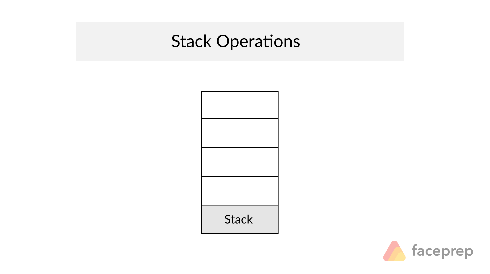

# Pilhas

Pilhas são estruturas de dados simples do tipo LIFO (Last-in, first-out), ou seja,
o último item a entrar é o primeiro a sair.



## Exercícios

1) Dada uma pilha P, construir uma função que inverte a ordem dos elementos dessa pilha, utilizando apenas uma estrutura auxiliar. Definir adequadamente a estrutura auxiliar e prever a possibilidade da pilha estar vazia.
2) Construir uma função que troca de lugar o elemento que está no topo
   da pilha com o que está na base da pilha. Usar apenas uma pilha como
   auxiliar.
3) Dada uma pilha contendo números inteiros quaisquer, construir uma
   função que coloca os pares na base da pilha e os ímpares no topo da
   pilha. Usar duas pilhas como auxiliares.

## Stack

Desenvolvi uma estrutura `Stack` que implementa o seguinte:

```c
typedef struct {
	int *items;
	int top;
} Stack;

void stack_init(Stack *stack);
bool stack_is_empty(Stack *stack);
int stack_pop(Stack *stack);
void stack_push(Stack *stack, int item);
int stack_size(Stack *stack);
int stack_stackpop(Stack *stack);
void stack_print(Stack *stack);
```

No exercício 1, é implementado `void stack_reverse(Stack *stack);`.

No exercício 2, é implementado `void stack_swap_top_and_bottom(Stack *stack);`.

No exercício 3, é implementado `void stack_sort_odd_and_even(Stack *stack);`. 
